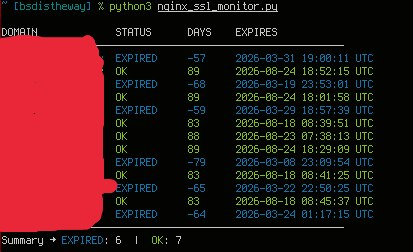

**nginx-ssl-cert-monitor** is a lightweight Python tool that inspects all HTTPS-enabled virtual hosts configured in Nginx and checks the expiration status of their SSL/TLS certificates.

It automatically extracts active `server_name` entries from `nginx -T`, connects to each domain over TLS, retrieves the certificate, and calculates the remaining validity period.

The tool is designed for sysadmins and DevOps engineers who want a fast, dependency-light way to monitor certificate expiration across multiple Nginx sites without external monitoring systems.




### 🔧 Features

* Auto-detects SSL-enabled domains from Nginx configuration (`nginx -T`)
* Connects directly to each domain over TLS and reads the certificate
* Calculates days until expiration
* Supports warning and critical thresholds
* Colored CLI output for human readability
* JSON output for automation / CI / monitoring tools
* Exit codes compatible with monitoring systems (Nagios-style)

### 🚨 Exit codes

* `0` → All certificates OK
* `1` → At least one WARNING (near expiration)
* `2` → At least one CRITICAL (very close to expiration)
* `3` → At least one expired certificate

### ⚙️ Requirements

* Python 3.9+
* `cryptography` library
* Nginx installed (`nginx -T` must be accessible)

Install dependency:

```bash
pip install cryptography
```

### 🚀 Usage

Check all domains:

```bash
python3 nginx_ssl_check.py
```

Custom thresholds:

```bash
python3 nginx_ssl_check.py --warn 30 --crit 7
```

JSON output:

```bash
python3 nginx_ssl_check.py --json
```

Check specific domains:

```bash
python3 nginx_ssl_check.py --domains example.com api.example.com
```

---


